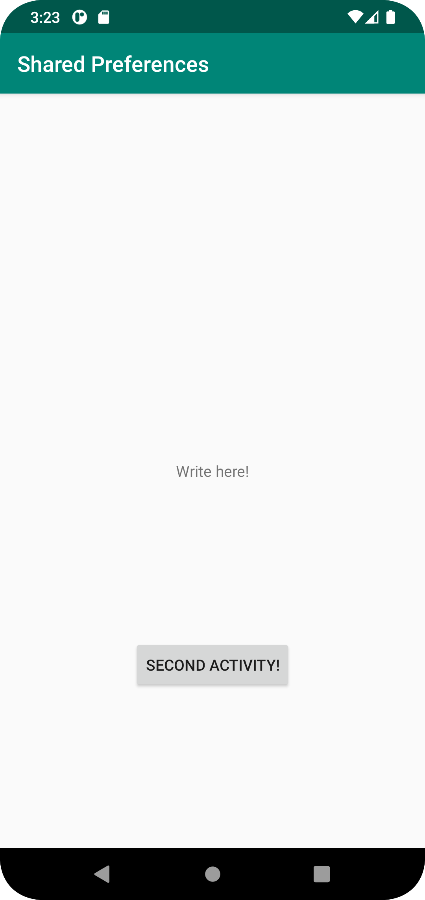
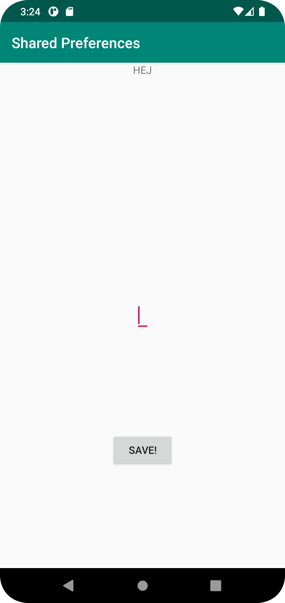
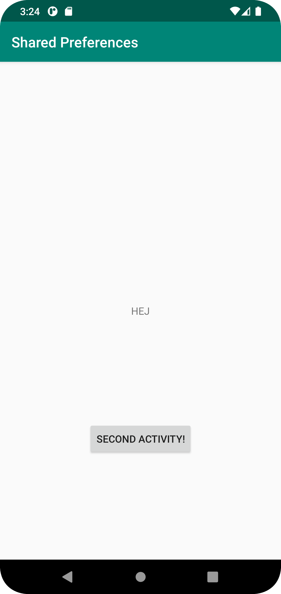

# Rapport

Det första som gjordes var att skapa en button, en textview och en onClickListener samt ett intent. 
Buttonen skapades i `activity_main.xml` samt `MainActivity.java`.
```
    <TextView
        android:id="@+id/prefText"
        android:layout_width="wrap_content"
        android:layout_height="wrap_content"
        android:text="@string/app_name"
        app:layout_constraintBottom_toBottomOf="parent"
        app:layout_constraintEnd_toEndOf="parent"
        app:layout_constraintStart_toStartOf="parent"
        app:layout_constraintTop_toBottomOf="@+id/appBarLayout" />

    <Button
        android:id="@+id/secondActivityButton"
        android:text="@string/second_activity"
        android:layout_width="wrap_content"
        android:layout_height="wrap_content"
        app:layout_constraintTop_toBottomOf="@+id/prefText"
        app:layout_constraintBottom_toBottomOf="parent"
        app:layout_constraintStart_toStartOf="parent"
        app:layout_constraintEnd_toEndOf="parent"/>
```
``` 
        Button button =(Button)findViewById(R.id.secondActivityButton);
        button.setOnClickListener(new View.OnClickListener() {
            @Override
            public void onClick(View view) {
                Intent intent = new Intent(MainActivity.this, SecondActivity.class);
                startActivity(intent);
            }
        });
```
Sedan så skapades en edittext och en button i `activity_second.xml` samt `SecondActivity.java`. 
Det skapades även en onClickListener.
``` 
    <EditText
        android:id="@+id/editText"
        android:layout_width="wrap_content"
        android:layout_height="wrap_content"
        android:text="@string/write_here"
        app:layout_constraintTop_toTopOf="parent"
        app:layout_constraintBottom_toBottomOf="parent"
        app:layout_constraintStart_toStartOf="parent"
        app:layout_constraintEnd_toEndOf="parent"/>

    <Button
        android:id="@+id/saveButton"
        android:text="@string/save"
        android:layout_width="wrap_content"
        android:layout_height="wrap_content"
        app:layout_constraintTop_toBottomOf="@+id/editText"
        app:layout_constraintBottom_toBottomOf="parent"
        app:layout_constraintStart_toStartOf="parent"
        app:layout_constraintEnd_toEndOf="parent"/>

```
``` 
 button = findViewById(R.id.saveButton);
        editText = findViewById(R.id.editText);
        textView = findViewById(R.id.textViewTest);

        button.setOnClickListener(new View.OnClickListener() {
            @Override
            public void onClick(View view) {
                textView.setText(editText.getText().toString());
                myPreferenceEditor.putString("123", editText.getText().toString());
                myPreferenceEditor.apply();
                editText.setText("");
```
efter detta lades shared prefrence kod in i både `MainActivity.java` samt `SecondActivity.java`. i 
OnCreate.
```
   myPreferenceRef = getSharedPreferences("123", MODE_PRIVATE);
       // myPreferenceRef = getPreferences(MODE_PRIVATE);
        myPreferenceEditor = myPreferenceRef.edit();

        prefTextRef=findViewById(R.id.prefText);
        prefTextRef.setText(myPreferenceRef.getString("123","tomt"));
```

``` 
        myPreferenceRef = getSharedPreferences("123", MODE_PRIVATE);
        //myPreferenceRef = getPreferences(MODE_PRIVATE);
        myPreferenceEditor = myPreferenceRef.edit();
```
sedan skapades en OnResume i `MainActivity.java` där kod körs när man går från andra aktiviteten till den andra.
``` 
    @Override
    protected void onResume() {
        super.onResume();
        prefTextRef=findViewById(R.id.prefText);
        prefTextRef.setText(myPreferenceRef.getString("123","tomt"));
    }
```


